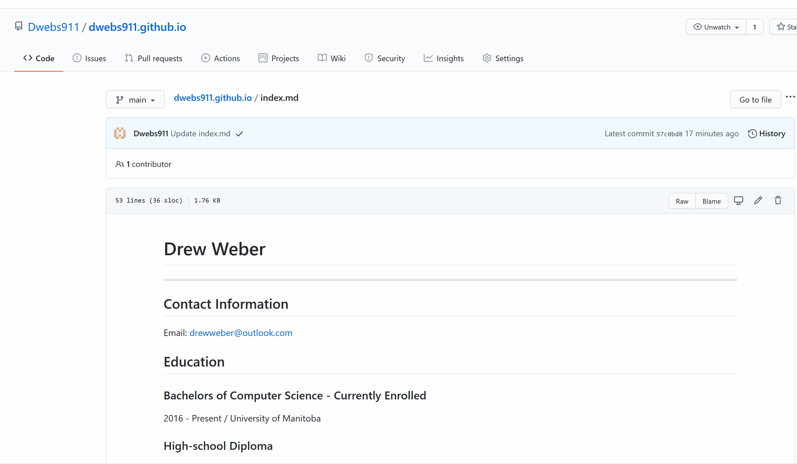

# How to Host a Markdown Resume on GitHub

----

## Why are we here?
This read-me will go into detail on how to learn and use the resources required to create and host a resume on GitHub Pages.  The technologies that will be covered in this guide are [Jekyll](https://jekyllrb.com/) , [Markdown](https://en.wikipedia.org/wiki/Markdown), and [GitHub](https://github.com/).  I will also be referring to [Modern Technical Writing by Andrew Etter](https://www.amazon.ca/Modern-Technical-Writing-Introduction-Documentation-ebook/dp/B01A2QL9SS) throughout the guide.  By the end of this guide you should be able to put together a markdown resume hosted on a professional looking webpage!

## Prerequisites:

This guide will require you to have some specific things listed below:

- Resume formatted in markdown
- GitHub Account 
- Web browser
- Time
- Willingness to learn

